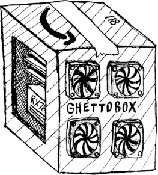

# ghettobox - self-hosting without router access
## how to use
1. checkout on `portal` or `internal` host
2. navigate to respective dir for host type
3. `cp template/compose.sh compose.sh`
4. `chmod u+x compose.sh`
5. enter desired environment variable values in `compose.sh`
6. use `compose.sh` as a substitute for `docker compose`

### notes for `portal` side
#### tailscale
- [official docker/tailscale guide](https://tailscale.com/blog/docker-tailscale-guide)
- OAuth client doesn't expire and only needs "write" permissions for "Devices"
#### preventing UDP bottleneck with Caddy
Buffer size needs to be increased on the **host**:
```
sysctl -w net.core.rmem_max=7500000
sysctl -w net.core.wmem_max=7500000
```

### notes for `service` side
#### filebrowser
You need to create an empty `database.db` file before bringing up the containers
if you're doing a fresh setup on a new host from git checkout.
```sh
touch volumes/filebrowser/database.db
```

Once the container is booted, you should change the login from the default 
`admin`/`admin` via the webUI.